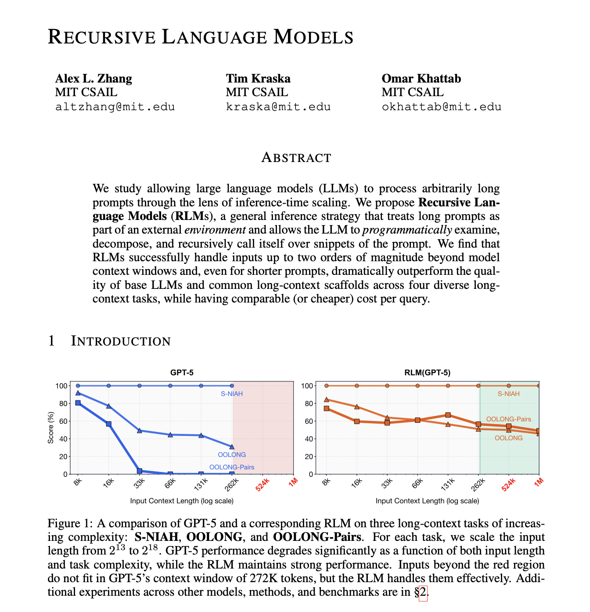

---

<h1 align="center" style="font-size:2.8em">
<span>Recursive Language Models (<span style="color:orange">RLM</span>s)</span>
</h1>

<p align="center" style="font-size:1.3em">
  <a href="https://arxiv.org/abs/2512.24601">Full Paper</a> •
  <a href="https://alexzhang13.github.io/blog/2025/rlm/">Blogpost</a> •
  <a href="https://alexzhang13.github.io/rlm/">Documentation</a> •
  <a href="https://github.com/alexzhang13/rlm-minimal">RLM Minimal</a>
</p>

<p align="center">
  <a href="https://github.com/alexzhang13/rlm/actions/workflows/style.yml">
    
  </a>
  <a href="https://github.com/alexzhang13/rlm/actions/workflows/test.yml">
    
  </a>
</p>

<p align="center">
  <a href="https://arxiv.org/abs/2512.24601">
    
  </a>
</p>

> [!IMPORTANT]
> This repository is a derived work based on the original Recursive Language Models project by Alex Zhang.
> Repository-level licensing for this copy is Apache-2.0. Upstream attribution and the original MIT license
> text for inherited portions are preserved in [NOTICE](NOTICE) and [LICENSES/upstream-rlm-mit.txt](LICENSES/upstream-rlm-mit.txt).

## Overview
Recursive Language Models (RLMs) are a task-agnostic inference paradigm for language models (LMs) to handle near-infinite length contexts by enabling the LM to *programmatically* examine, decompose, and recursively call itself over its input. RLMs replace the canonical `llm.completion(prompt, model)` call with a `rlm.completion(prompt, model)` call. RLMs offload the context as a variable in a REPL environment that the LM can interact with and launch sub-LM calls inside of.

This repository provides an extensible inference engine for using RLMs around standard API-based and local LLMs. The initial experiments and idea were proposed in a [blogpost](https://alexzhang13.github.io/blog/2025/rlm/) in 2025, with expanded results in an [arXiv preprint](https://arxiv.org/abs/2512.24601).

> [!NOTE]
> This repository contains inference code for RLMs with support for various sandbox environments. Open-source contributions are welcome. This repository is maintained by the authors of the paper from the MIT OASYS lab.

---

## Table of Contents

- [Quick Setup](#quick-setup)
- [CLI — Command Line Interface](#cli--command-line-interface)
- [Server & Gateways](#server--gateways)
- [WebChat](#webchat)
- [Environment Variables](#environment-variables)
- [Skills System](#skills-system)
- [Memory System](#memory-system)
- [REPL Environments](#repl-environments)
- [Model Providers](#model-providers)
- [Scheduler](#scheduler)
- [Architecture](#architecture)
- [Debugging & Visualizer](#debugging--visualizer)
- [Testing](#testing)
- [Citation](#citation)

---

## Quick Setup

### Requirements

- Python ≥ 3.11
- An LLM API key (OpenAI, Anthropic, or Google)

### Install

```bash
# With uv (recommended)
curl -LsSf https://astral.sh/uv/install.sh | sh
uv init && uv venv --python 3.12
uv pip install -e .

# Or with pip
pip install -e .
```

### First Run (wizard interativo)

```bash
rlm setup
```

O wizard configura:
1. **Chave de API** — OpenAI, Anthropic ou Google
2. **Modelo padrão** — gpt-4o-mini, gpt-4o, claude-3-5-haiku, etc.
3. **Endereços** — API REST e WebSocket
4. **Tokens de segurança** — gerados automaticamente
5. **Daemon** — systemd (Linux) ou launchd (macOS)

Resultado: arquivo `.env` pronto para uso.

### Uso como biblioteca Python

```python
from rlm import RLM

rlm = RLM(
    backend="openai",
    backend_kwargs={"model_name": "gpt-4o-mini"},
    verbose=True,
)

print(rlm.completion("Print me the first 100 powers of two.").response)
```

### Uso via servidor

```bash
rlm start              # Inicia API + WebSocket em background
# Acesse http://localhost:5000/webchat para conversar
rlm stop               # Para o servidor
```

---

## CLI — Command Line Interface

Após `pip install -e .`, o comando `rlm` fica disponível globalmente.  
Também funciona via `python -m rlm`.

| Comando | Descrição |
|---|---|
| `rlm setup` | Wizard interativo de primeira instalação |
| `rlm start` | Inicia o servidor (API + WebSocket) em background |
| `rlm start --foreground` | Inicia no terminal com logs ao vivo |
| `rlm start --api-only` | Apenas API REST (sem WebSocket) |
| `rlm stop` | Para todos os processos RLM |
| `rlm status` | Mostra processos ativos, PIDs e endpoints |
| `rlm update` | Atualiza o checkout git local e roda `uv sync` |
| `rlm doctor` | Diagnóstico completo: .env, API key, servidor, canais |
| `rlm version` | Versão instalada |
| `rlm token rotate` | Regenera RLM_WS_TOKEN e RLM_HOOK_TOKEN |
| `rlm skill list` | Lista skills instaladas com versão e status |
| `rlm skill install <source>` | Instala skill remota (GitHub ou URL) |
| `rlm channel list` | Mostra canais configurados e faltantes |
| `rlm peer add --name X --pubkey Y --ip Z` | Adiciona peer WireGuard |

### Exemplos de uso

```bash
# Primeira vez
rlm setup

# Verificar se tudo está OK
rlm doctor

# Atualizar checkout local com fast-forward seguro
rlm update

# Iniciar e acompanhar logs
rlm start --foreground

# Ver quais canais estão ativos
rlm channel list

# Instalar skill do GitHub
rlm skill install github:usuario/minha-skill
rlm skill install github:usuario/minha-skill@branch

# Rotacionar tokens (após possível vazamento)
rlm token rotate
rlm stop && rlm start
```

### Makefile shortcuts

```bash
make setup    # equivalente a: rlm setup
make start    # equivalente a: rlm start
make stop     # equivalente a: rlm stop
make status   # equivalente a: rlm status
make test     # roda a suíte de testes
make check    # lint + format + tests
```

---

## Server & Gateways

O servidor FastAPI expõe os seguintes endpoints:

### API REST Principal

| Método | Endpoint | Descrição |
|---|---|---|
| `POST` | `/webhook/{client_id}` | Recebe e processa evento (precisa `RLM_HOOK_TOKEN`) |
| `GET` | `/sessions` | Lista sessões ativas |
| `GET` | `/sessions/{id}` | Detalhes de uma sessão |
| `DELETE` | `/sessions/{id}` | Aborta execução |
| `GET` | `/sessions/{id}/events` | Log de eventos |
| `GET` | `/plugins` | Plugins disponíveis |
| `GET` | `/routes` | Rotas configuradas |
| `GET` | `/health` | Health check |
| `GET` | `/status` | Status detalhado do engine |

### OpenAI-Compatible API

| Método | Endpoint | Descrição |
|---|---|---|
| `POST` | `/v1/chat/completions` | Endpoint compatível com OpenAI SDK (precisa `RLM_API_TOKEN`) |

Permite usar o RLM como drop-in replacement em qualquer app que use a API da OpenAI.

### Gateways de Canal

Cada gateway é ativado automaticamente quando as variáveis de ambiente correspondentes estão configuradas:

| Canal | Endpoint | Variáveis necessárias |
|---|---|---|
| **WebChat** | `GET /webchat` | Sempre ativo |
| **Telegram** | Polling (sem endpoint) | `TELEGRAM_BOT_TOKEN` |
| **Discord** | `POST /discord/interactions` | `DISCORD_APP_PUBLIC_KEY`, `DISCORD_APP_ID` |
| **WhatsApp** | `GET+POST /whatsapp/webhook` | `WHATSAPP_TOKEN`, `WHATSAPP_PHONE_ID`, `WHATSAPP_VERIFY_TOKEN` |
| **Slack** | `POST /slack/events` | `SLACK_BOT_TOKEN`, `SLACK_SIGNING_SECRET` |

### WebSocket (Observabilidade)

Servidor WebSocket em `ws://127.0.0.1:8765` transmite todos os eventos em tempo real:
- Execuções de código REPL
- Respostas do LLM
- Erros e abort events
- Skills carregadas

Autenticação via `?token=<RLM_WS_TOKEN>` ou header `Authorization: Bearer <token>`.

---

## WebChat

Interface web integrada acessível em `http://localhost:5000/webchat`.

### Funcionalidades

- **Dark mode** — tema escuro com Tailwind CSS
- **Streaming** — respostas em tempo real via Server-Sent Events (SSE)
- **Markdown** — renderização de código, negrito, itálico, listas, títulos
- **Sessão persistente** — ID salvo em localStorage, sobrevive a refresh
- **Teclas** — Enter para enviar, Shift+Enter para nova linha
- **Auto-resize** — textarea se expande conforme você digita
- **Health check** — indicador visual de conexão (verde/amarelo/cinza)

Desabilitar: `RLM_WEBCHAT_DISABLED=true`

---

## Environment Variables

Todas as variáveis estão documentadas em [`.env.example`](.env.example).

Resumo por categoria:

| Variável | Default | Descrição |
|---|---|---|
| **LLM** | | |
| `OPENAI_API_KEY` | — | Chave da API OpenAI |
| `ANTHROPIC_API_KEY` | — | Chave da API Anthropic |
| `GOOGLE_API_KEY` | — | Chave da API Google |
| `RLM_MODEL` | `gpt-4o-mini` | Modelo padrão |
| `RLM_BACKEND` | `openai` | Backend: openai, anthropic, google, portkey |
| **Servidor** | | |
| `RLM_API_HOST` | `127.0.0.1` | Bind da API REST |
| `RLM_API_PORT` | `5000` | Porta da API REST |
| `RLM_WS_HOST` | `127.0.0.1` | Bind do WebSocket |
| `RLM_WS_PORT` | `8765` | Porta do WebSocket |
| `RLM_CORS_ORIGINS` | (vazio) | Origens CORS permitidas (vírgula-separado) |
| **Segurança** | | |
| `RLM_WS_TOKEN` | — | Token de autenticação WebSocket |
| `RLM_HOOK_TOKEN` | — | Token para webhooks externos |
| `RLM_API_TOKEN` | — | Token para API OpenAI-compatible |
| `RLM_JWT_SECRET` | — | Secret para autenticação JWT avançada |
| **Engine** | | |
| `RLM_MAX_ITERATIONS` | `30` | Máximo de iterações REPL por completion |
| `RLM_TIMEOUT` | `120` | Timeout global (segundos) |
| `RLM_MAX_ERRORS` | `5` | Erros consecutivos antes do abort |
| `RLM_MAX_DEPTH` | `2` | Profundidade máxima de recursão |
| `RLM_LOG_LEVEL` | `info` | Nível de log: debug, info, warning, error |
| **Persistência** | | |
| `RLM_DB_PATH` | `rlm_sessions.db` | SQLite de sessões |
| `RLM_STATE_ROOT` | `./rlm_states` | Diretório de estados |
| `RLM_SCHEDULER_DB` | `~/.rlm/scheduler.db` | SQLite do scheduler |
| `RLM_SCHEDULER_WORKERS` | `4` | Workers paralelos do scheduler |

Referência completa com variáveis de canal: veja [`.env.example`](.env.example).

---

## Skills System

O RLM possui 19 skills integradas que ampliam as capacidades do agente:

| Skill | Descrição |
|---|---|
| `browser` | Navega e extrai conteúdo de páginas web |
| `calendar` | Gerencia agenda e eventos |
| `email` | Lê e envia emails |
| `filesystem` | Lê, escreve e lista arquivos locais |
| `github` | Interage com repositórios GitHub |
| `maps` | Busca direções e locais |
| `memory` | Busca no histórico de memória persistente |
| `notion` | Lê e escreve páginas Notion |
| `playwright` | Automação de browser headless |
| `shell` | Executa comandos no terminal |
| `slack` | Interage com workspaces Slack |
| `sqlite` | Consulta bancos SQLite |
| `telegram_bot` | Controla bot Telegram |
| `travel` | Busca voos e hotéis |
| `twitter` | Interage com Twitter/X |
| `voice` | Text-to-speech e speech-to-text |
| `weather` | Consulta previsão do tempo |
| `web_search` | Pesquisa na web (DuckDuckGo, sem API key) |
| `whatsapp` | Envia mensagens WhatsApp |

### Arquitetura Smart Skill Delivery (3 camadas)

1. **Index compacto** (~30 tokens/skill) — sempre no system prompt
2. **Keyword routing** — se tags da skill aparecem na query, o body é injetado (zero LLM calls)
3. **`skill_doc()` on-demand** — LLM chama no REPL quando precisa de exemplos detalhados

### SIF — Skill Interface Format

Cada skill é definida por um `SKILL.md` com frontmatter TOML:

```toml
+++
name = "web_search"
description = "Search the web using DuckDuckGo..."
tags = ["pesquisar", "buscar", "google"]
priority = "always"

[sif]
signature = "web_search(query: str, max_results: int = 5) -> list[dict]"
short_sig = "web_search(q,n=5)→[{}]"
compose = ["browser", "playwright"]
impl = """
def web_search(query, max_results=5):
    ...
"""
+++
```

### Instalação de skills remotas

```bash
rlm skill install github:usuario/repositorio
rlm skill install github:usuario/repositorio@branch
rlm skill install https://raw.githubusercontent.com/.../SKILL.md
```

---

## Memory System

Memória persistente baseada em **SQLite FTS5 + busca vetorial por similaridade de cosseno**.

### Funcionamento

- **Escrita automática**: após cada interação, o conteúdo é salvo em `rlm_memory_v2.db`
- **Leitura automática**: antes de cada resposta, busca híbrida (BM25 + RRF + temporal decay) traz contexto relevante
- **Sanitização**: proteção contra injeção de prompt no read time (sem alterar o SQLite)
- **Lazy init**: memória só é instanciada no primeiro uso (zero overhead se não usada)

### Componentes

| Módulo | Localização | Função |
|---|---|---|
| `MultiVectorMemory` | `rlm/core/memory_manager.py` | Engine de armazenamento e busca |
| Memory Tools | `rlm/tools/memory.py` | Wrapper para uso no REPL |
| Session integration | `rlm/session.py` | Search pré-resposta + persist pós-interação |
| Memory skill | `rlm/skills/memory/SKILL.md` | Documentação para o LLM |

### Uso direto

```python
from rlm.core.memory_manager import MultiVectorMemory

mem = MultiVectorMemory(db_path="rlm_memory_v2.db")

# Salvar memória
mem.add_memory(session_id="abc123", content="O usuário prefere respostas em português")

# Busca híbrida
results = mem.search_hybrid(
    "preferências do usuário",
    limit=5,
    session_id="abc123",
    temporal_decay=True,
    half_life_days=30,
)
```

---

## REPL Environments

O RLM suporta múltiplos ambientes de execução de código:

| Ambiente | Isolamento | Requisitos |
|---|---|---|
| `local` (default) | Nenhum — mesmo processo | — |
| `docker` | Container isolado | Docker instalado |
| `modal` | Cloud sandbox | Conta Modal + `uv pip install -e ".[modal]"` |
| `prime` | Cloud sandbox | API key Prime Intellect + `uv pip install -e ".[prime]"` |
| `daytona` | Cloud/self-hosted | API key Daytona + `uv pip install -e ".[daytona]"` |

```python
rlm = RLM(
    environment="docker",  # "local", "docker", "modal", "prime", "daytona"
    environment_kwargs={},
)
```

### Local (default)

O `LocalREPL` executa código no mesmo processo via Python `exec`. Compartilha o mesmo virtualenv. Seguro para uso pessoal, mas não recomendado para produção com inputs não-confiáveis.

### Docker

O `DockerREPL` lança containers isolados. Image padrão: `python:3.11-slim`.

```python
rlm = RLM(environment="docker")
```

### Modal Sandboxes

```bash
uv add modal
modal setup  # autenticação
```

### Prime Intellect Sandboxes

```bash
uv pip install -e ".[prime]"
export PRIME_API_KEY=...
```

---

## Model Providers

| Provider | Backend | Notas |
|---|---|---|
| OpenAI | `openai` | GPT-4o, GPT-5-nano, o1-mini, etc. |
| Anthropic | `anthropic` | Claude 3.5, Claude 4, etc. |
| Google | `google` | Gemini 2.0 Flash, etc. |
| Portkey | `portkey` | Router multi-provider |
| LiteLLM | `litellm` | Proxy universal |
| vLLM | `openai` | Modelos locais via API OpenAI-compatible |

```python
# OpenAI
rlm = RLM(backend="openai", backend_kwargs={"model_name": "gpt-4o-mini"})

# Anthropic
rlm = RLM(backend="anthropic", backend_kwargs={"model_name": "claude-3-5-haiku"})

# Modelo local via vLLM
rlm = RLM(backend="openai", backend_kwargs={
    "model_name": "meta-llama/Llama-3-8B",
    "base_url": "http://localhost:8000/v1",
})
```

---

## Scheduler

Sistema de agendamento de tarefas persistente com SQLite.

### Tipos de trigger

| Tipo | Exemplo | Descrição |
|---|---|---|
| `cron` | `0 9 * * 1-5` | Expressão cron padrão |
| `once` | `2026-03-15T10:00:00` | Executa uma vez em data/hora |
| `interval` | `3600` | A cada N segundos |
| `condition` | `"value > 100"` | Avaliação condicional (via `ast.literal_eval`) |

### Funcionalidades

- Persistência em SQLite (sobrevive a restarts)
- Workers configuráveis (`RLM_SCHEDULER_WORKERS`)
- Notificações via Telegram (se configurado)
- Integração com SessionManager (executa na sessão do client_id)

---

## Architecture

```
┌─────────────┐     ┌─────────────┐     ┌──────────────┐
│  WebChat    │     │  Telegram   │     │  Discord/    │
│  (SSE)     │     │  (Polling)  │     │  Slack/WA   │
└──────┬──────┘     └──────┬──────┘     └──────┬───────┘
       │                   │                   │
       └───────────┬───────┴───────────────────┘
                   │
          ┌────────▼────────┐
          │  FastAPI Server  │  ← api.py (endpoints REST)
          │    (api.py)      │
          └────────┬────────┘
                   │
          ┌────────▼────────┐
          │  SessionManager  │  ← core/session.py (pool SQLite)
          │                  │
          └────────┬────────┘
                   │
          ┌────────▼────────┐
          │   RLMSession     │  ← session.py (wrapper conversacional)
          │  ┌────────────┐  │
          │  │    RLM      │  │  ← core/rlm.py (engine recursivo)
          │  └────────────┘  │
          │  ┌────────────┐  │
          │  │MultiVector  │  │  ← core/memory_manager.py (memória)
          │  │  Memory     │  │
          │  └────────────┘  │
          └────────┬────────┘
                   │
          ┌────────▼────────┐
          │  REPL Env        │  ← environments/ (local/docker/modal)
          │  + Skills (19)   │  ← skills/ (SKILL.md + SIF)
          │  + Plugins       │  ← plugins/ (audio/browser/channels)
          └─────────────────┘
```

### Camadas

| Camada | Módulo | Responsabilidade |
|---|---|---|
| **Gateways** | `rlm/server/` | HTTP, WebSocket, SSE, channel-specific |
| **Orquestração** | `SessionManager` + `Supervisor` | Pool de sessões, timeout, abort, error detection |
| **Sessão** | `RLMSession` | Estado conversacional, memória, compaction |
| **Engine** | `RLM` | Completion recursiva, sub-RLM calls, MCTS |
| **Execução** | `environments/` | REPL sandboxes com persistência de namespace |
| **Skills** | `skills/` + `skill_loader.py` | Discovery, routing, injection no system prompt |
| **Plugins** | `plugins/` | Channel clients, audio, browser, MCP |
| **Persistência** | SQLite | Sessões, scheduler, memória FTS5 |

---

## Debugging & Visualizer

### Logs estruturados

O RLM usa logging estruturado configurável via `RLM_LOG_LEVEL`:

```bash
RLM_LOG_LEVEL=debug rlm start --foreground
```

### Visualizador de trajetórias

Salve logs `.jsonl` e visualize no browser:

```python
from rlm.logger import RLMLogger
from rlm import RLM

logger = RLMLogger(log_dir="./logs")
rlm = RLM(
    backend="openai",
    backend_kwargs={"model_name": "gpt-4o-mini"},
    logger=logger,
)
```

Os logs capturam:
- Cada chamada ao LLM com prompt e resposta
- Código executado no REPL e output
- Sub-RLM calls e sua árvore de recursão
- Tempos de execução por etapa

Veja também: docs/logging.md

### Diagnóstico do sistema

```bash
rlm doctor
```

Verifica:
- Arquivo `.env` presente e com variáveis obrigatórias
- Conexão com a API do LLM (teste real)
- Tokens de segurança configurados
- Servidor online ou offline
- Canais configurados vs. faltantes

---

## Testing

```bash
# Rodar todos os testes
make test

# Ou diretamente
pytest tests/ -q --override-ini="addopts="

# Excluir testes que fazem chamadas reais à API
pytest tests/ -q -m "not live_llm"

# Testes com coverage
pytest tests/ --cov=rlm --cov-report=term-missing
```

### Arquivos de teste especiais

| Arquivo | Notas |
|---|---|
| `test_live_llm.py` | Faz chamadas reais à OpenAI (lento, custa tokens) |
| `test_backend_verification.py` | Requer extensão Rust compilada |
| `test_critical_skills.py` | Requer módulo `rlm.plugins.mcp` |

---

## Citation

```bibtex
@misc{zhang2025recursivelanguagemodels,
      title={Recursive Language Models}, 
      author={Alex L. Zhang and Tim Kraska and Omar Khattab},
      year={2025},
      eprint={2512.24601},
      archivePrefix={arXiv},
      primaryClass={cs.AI},
      url={https://arxiv.org/abs/2512.24601}, 
}
```

---

## Relevant Reading
* **[Dec '25]** [Recursive Language Models arXiv](https://arxiv.org/abs/2512.24601)
* **[Oct '25]** [Recursive Language Models Blogpost](https://alexzhang13.github.io/blog/2025/rlm/)

---

## License

See [LICENSE](LICENSE) for details.

To run the visualizer locally, we use Node.js and shadcn/ui:
```
cd visualizer/
npm run dev        # default localhost:3001
```

You'll have the option to select saved `.jsonl` files 
<p align="center">
  
</p>
